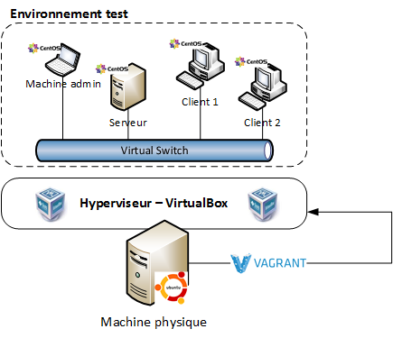
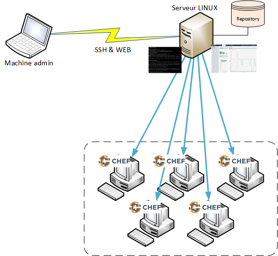
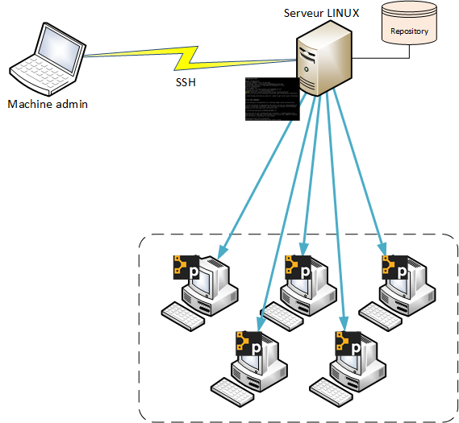
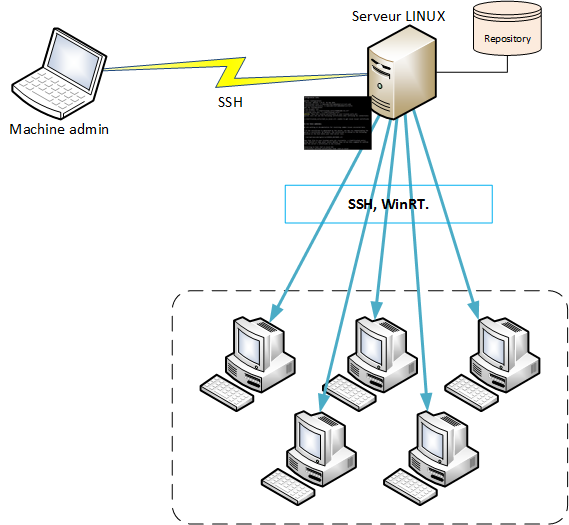
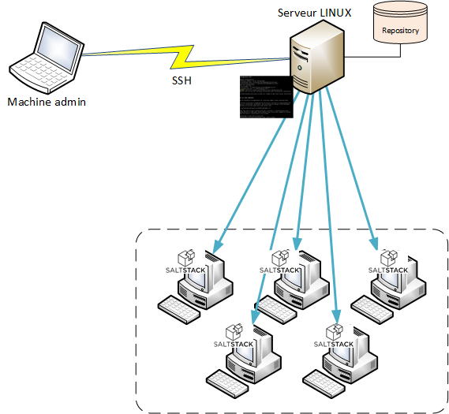

### Analyse comparative d'outils de déploiement et de configuration automatisée

Présenté par Valentin GOEMANNE

Juin 2017

---

## Sommaire
 - <span class ="fragment">Le CETIC ? C'est quoi ?</span>  
 - <span class ="fragment">Problématique et solutions </span>
 - <span class ="fragment">Environnement</span> 
 - <span class ="fragment">Analyse et résultats</span>
 - <span class ="fragment">Conclusion </span> 

---

## Le CETIC ? C'est quoi ?
<strong class="fragment">C</strong>entre d'<strong class="fragment">E</strong>xcellence <strong class="fragment">T</strong>echnologie de l'<strong class="fragment">I</strong>nformation et de la <strong class="fragment">C</strong>ommunication 

+++
### Présentation
- <span class="fragment">ASBL</span>
- <span class="fragment">45 personnes</span>
- <span class="fragment">15 ans</span>
- <span class="fragment">Aéropôle, Gosselies</span>
+++
### Missions
- <span class="fragment">Promouvoir l'IT </span>
  - <span class="fragment">Expertise</span>
  - <span class="fragment">Prototypage</span>
- <span class="fragment">Ne pas faire de concurence aux entreprises</span>
---
### Problématique du TFE
- <span class="fragment">L'installation et la configuration de serveur est complexe</span>
+++
### Les solutions 

- <span class="fragment">Logiciel de gestion de configuration</span>

+++

---
### Environnement 
- <span class ="fragment">Virtualisation </span>
+++
### Virtualisation
- <span class ="fragment">Virtualiser des environements informatiques  </span>
- <span class ="fragment">à l'aide des ressources de la physique </span>
- <span class ="fragment">Hyperviseur </span>
+++
### Vagrant 
- <span class ="fragment">Logiciel permettant de piloter l'hyperviseur</span>
- <span class ="fragment">Création de VM à l'aide d'un fichier</span>
+++


---

### Les solutions

- <span class="fragment">Chef</span>
- <span class="fragment">Puppet</span>
- <span class="fragment">Ansible</span>
- <span class="fragment">Saltstack</span>

+++
### Les critères de comparaison 
- <span class="fragment">Facilité d'installation</span>
- <span class="fragment">Facilité d'utilisation</span>
- <span class="fragment">Environnement</span>
- <span class="fragment">Architecture</span>
+++

<table style="font-size: 60%;">
  <tr>
    <th>Solutions</th>
    <th>Facilité d'installation</th>
    <th>Facilité d'utilisation</th>
    <th>Environement</th>
    <th>Archicteture</th>
  </tr>
  <tr>
    <td>Puppet</td>
    <td>°°</td>
    <td>°°</td>
    <td>°°</td>
    <td>Serveur/Client</td>
  </tr>
    <tr>
    <td>Chef</td>
    <td>°°°</td>
    <td>°°°°</td>
    <td>°°°</td>
    <td>Serveur/Client</td>
  </tr>
    <tr>
    <td>Ansible</td>
    <td>°°°°</td>
    <td>°°°</td>
    <td>°°°°</td>
    <td>Agent-Less</td>
  </tr>
    <tr>
    <td>SaltStack</td>
    <td>°°°</td>
    <td>°°°</td>
    <td>°°°</td>
    <td>Serveur/Client</td>
  </tr>
</table>
+++


### Chef
- <span class="fragment">Opscode</span>
- <span class="fragment">2009</span>
- <span class="fragment">Ruby</span>
- <span class="fragment">Serveur/Client</span>
- <span class="fragment">3 modes de fonctionnement</span>
- <span class="fragment">Cookbooks</span>
- <span class="fragment">Apache 2.0</span>

+++
### Chef


+++
### Cookbooks
- <span class="fragment">Dossier</span>
- <span class="fragment">Recettes en RubyDSL</span>
- <span class="fragment">Templates</span>

+++
### Puppet

- <span class="fragment">Puppet Labs</span>
- <span class="fragment">2003</span>
- <span class="fragment">Ruby</span>
- <span class="fragment">Serveur/Client</span>
- <span class="fragment">Manifest en RubyDSL</span>
- <span class="fragment">Apache 2.0</span>
+++
### Puppet

+++
### Manifest

```ruby
node 'puppetagent1.int.cetic.be' {
include util
}

class util {
        package { 'tree':
                ensure => installed
        }
        package { 'mc':
                ensure => installed
        }
        package { 'nano':
                ensure => installed
        }

}

``` 

+++
### Ansible
- <span class="fragment">Red Hat</span>
- <span class="fragment">2012</span>
- <span class="fragment">Python</span>
- <span class="fragment">Agent-Less</span>
- <span class="fragment">Playbook en YAML</span>
- <span class="fragment">GPL-3.0</span>
+++
### Puppet


+++
### Playbook

```yaml
- hosts: linode
  remote_user: yourusername
  become: yes
  become_method: sudo
  tasks:
    - name: "Install Apache, MySQL, and PHP5"
      apt: name={{ item }} state=present
      with_items:
        - apache2
        - mysql-server
        - python-mysqldb
        - php5
        - php-pear
        - php5-mysql
```
+++
### SaltStack
- <span class="fragment">Tom Hatch</span>
- <span class="fragment">2011</span>
- <span class="fragment">Python</span>
- <span class="fragment">Serveur/Client</span>
- <span class="fragment">State en YAML </span>
- <span class="fragment">Apache 2.0</span>
+++
### Puppet


+++

### State
```yaml
nginx:
  pkg:
    - installed
  service:
    - running
    - watch:
      - pkg: nginx
      - file: /etc/nginx/nginx.conf
```
+++


<table style="font-size: 60%;">
  <tr>
    <th>Solutions</th>
    <th>Facilité d'installation</th>
    <th>Facilité d'utilisation</th>
    <th>Environement</th>
    <th>Archicteture</th>
  </tr>
  <tr>
    <td>Puppet</td>
    <td>°°</td>
    <td>°°</td>
    <td>°°</td>
    <td>Serveur/Client</td>
  </tr>
    <tr>
    <td>Chef</td>
    <td>°°°</td>
    <td>°°°°</td>
    <td>°°°</td>
    <td>Serveur/Client</td>
  </tr>
    <tr>
    <td>Ansible</td>
    <td>°°°°</td>
    <td>°°°</td>
    <td>°°°°</td>
    <td>Agent-Less</td>
  </tr>
    <tr>
    <td>SaltStack</td>
    <td>°°°</td>
    <td>°°°</td>
    <td>°°°</td>
    <td>Serveur/Client</td>
  </tr>
</table>


---


### Conclusion 

- <span class="fragment">Autonomie</span>
- <span class="fragment">Curiosité</span>

---

### Question ? 