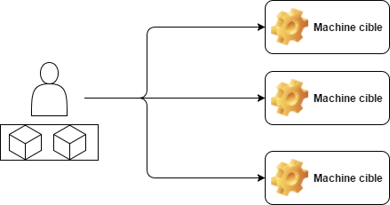
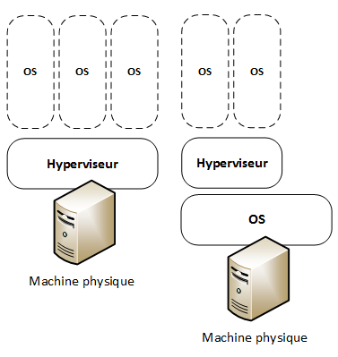
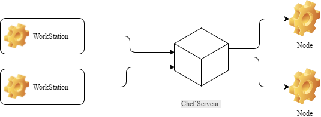

### Analyse comparative d'outils de déploiment et de configuration automatisée
Stage de fin d'étude réalisé au CETIC
Présenté par Valentin GOEMANNE

Sous la direction de Sébastien DUPONT et de Michel HANOTIAUX

Juin 2017

---
## Remerciment 
---
## Sommaire
 - <span class ="fragment">Le CETIC ? C'est quoi ?</span>  
 - <span class ="fragment">Problématiques et solutions </span>
 - <span class ="fragment">Environement</span> 
 - <span class ="fragment">Analyse et résultat</span>
 - <span class ="fragment"> Conclusion </span> 

---

## Le CETIC ? C'est quoi ?
<strong class="fragment">C</strong>entre d'<strong class="fragment">E</strong>xcellence <strong class="fragment">T</strong>echnologie de l'<strong class="fragment">I</strong>nformation et de la <strong class="fragment">C</strong>ommunication 

+++
### Présentation
- <span class="fragment">ASBL</span>
- <span class="fragment">45 personnes</span>
- <span class="fragment">15 ans</span>
- <span class="fragment">Zoning de Gosselies</span>


---
### Les problématique ?
- <span class="fragment">L'installation et la configuration de serveur est complexe</span>
+++

+++
### Les solutions 

- <span class="fragment">Logiciel de gestion de configuration</span>

+++


---
### Environement 
- <span class ="fragment">Virtualisation </span>
- <span class ="fragment">Technologie des conteneur</span>
+++
### Virtualisation

+++

+++
### Technologie conteneur 
- <span class="fragment">Isolement d'un environement en utilisant les resources de la machine hote</span>
- <span class="fragment">Excution de logiciel en toute transparance sur n'importe quel environement</span>
- <span class="fragment">Permet un déploiment très facile </span>

+++
### Virtualisation Vs Conteneurs


---

### Les solutions

- <span class="fragment">Puppet</span>
- <span class="fragment">Chef</span>
- <span class="fragment">Ansible</span>
- <span class="fragment">Saltstack</span>
- <span class="fragment">Rudder</span>
- <span class="fragment">OpenShift</span>

+++
### Chef
- <span class="fragment">Opscode</span>
- <span class="fragment">2009</span>
- <span class="fragment">Ruby</span>
- <span class="fragment">Serveur/Client</span>
- <span class="fragment">3 modes de fonctionnement</span>
- <span class="fragment">Cookbooks</span>
- <span class="fragment">Apache 2.0</span>
+++
### Cookbooks
- <span class="fragment">Dossier</span>
- <span class="fragment">Recettes en RubyDSL</span>
- <span class="fragment">Templates</span>

+++
### Recipes

```ruby
package  = "vim"

execute "apt-get update" do
 command "apt-get update"
end

apt_package package do
 action :install
end
```
+++
### Chef

- <span class="fragment">Workstation : machine admin </span>
- <span class="fragment">Serveur Chef </span>
- <span class="fragment">Node : machine cible </span>

+++
### Puppet

- <span class="fragment">Puppet Labs</span>
- <span class="fragment">2003</span>
- <span class="fragment">Ruby</span>
- <span class="fragment">Serveur/Client</span>
- <span class="fragment">Manifest en RubyDSL</span>
- <span class="fragment">Apache 2.0</span>
+++
### Manifest

```ruby
node 'puppetagent1.int.cetic.be' {
include util
}

class util {
        package { 'tree':
                ensure => installed
        }
        package { 'mc':
                ensure => installed
        }
        package { 'nano':
                ensure => installed
        }

}

``` 

+++
### Ansible
- <span class="fragment">Red Hat</span>
- <span class="fragment">2012</span>
- <span class="fragment">Python</span>
- <span class="fragment">Client</span>
- <span class="fragment">Playbook en YAML</span>
- <span class="fragment">GPL-3.0</span>
+++
### Playbook

```yaml
- hosts: linode
  remote_user: yourusername
  become: yes
  become_method: sudo
  tasks:
    - name: "Install Apache, MySQL, and PHP5"
      apt: name={{ item }} state=present
      with_items:
        - apache2
        - mysql-server
        - python-mysqldb
        - php5
        - php-pear
        - php5-mysql
```

+++
### Ansible Tower

+++
### SaltStack
- <span class="fragment">Tom Hatch</span>
- <span class="fragment">2011</span>
- <span class="fragment">Python</span>
- <span class="fragment">Serveur/Client</span>
- <span class="fragment">State en YAML </span>
- <span class="fragment">Apache 2.0</span>
+++

### State
```yaml
nginx:
  pkg:
    - installed
  service:
    - running
    - watch:
      - pkg: nginx
      - file: /etc/nginx/nginx.conf
```

---


### Les critères de comparaison 
- <span class="fragment">Facilité d'installation</span>
- <span class="fragment">facilité d'utilisation</span>
- <span class="fragment">Evolution</span>
- <span class="fragment">Architecture</span>
+++

<table style="font-size: 60%;">
  <tr>
    <th>Solutions</th>
    <th>Facilité d'installation</th>
    <th>Facilité d'utilisation</th>
    <th>Evolution</th>
    <th>Archicteture</th>
  </tr>
  <tr>
    <td>Puppet</td>
    <td>°°</td>
    <td>°°</td>
    <td>°°</td>
    <td>Serveur/Client</td>
  </tr>
    <tr>
    <td>Chef</td>
    <td>°°°</td>
    <td>°°°°</td>
    <td>°°°</td>
    <td>Serveur/Client</td>
  </tr>
    <tr>
    <td>Ansible</td>
    <td>°°°°</td>
    <td>°°°</td>
    <td>°°°°</td>
    <td>Client</td>
  </tr>
    <tr>
    <td>SaltStack</td>
    <td>°°°</td>
    <td>°°°</td>
    <td>°°°</td>
    <td>Serveur/Client</td>
  </tr>
    <tr>
    <td>OpenShift</td>
    <td>°°°°</td>
    <td>°°°°</td>
    <td>°°°°</td>
    <td>Serveur</td>
  </tr>
</table>


---

### Résumé 
---


### Conclusion 

- <span class="fragment">Autonomie</span>
- <span class="fragment">Curiosité</span>