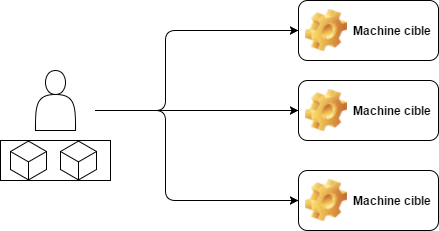
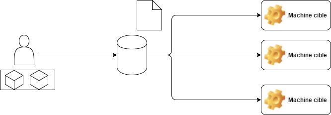

### Analyse comparative d'outils de déploiment et de configuration automatisée
Stage de fin d'étude réalisé au CETIC
Présenté par Valentin GOEMANNE

Sous la direction de Sébastien DUPONT et de Michel HANOTIAUX

Juin 2017

---
## Remerciment 
---
## Sommaire
 - Le CETIC ? C'est quoi ?  
 - Problématiques et solutions 
 - Analyse et résultat
 -  Conclusion  

---

## Le CETIC ? C'est quoi ?
<strong class="fragment">C</strong>entre d'<strong class="fragment">E</strong>xcellence <strong class="fragment">T</strong>echnologie de l'<strong class="fragment">I</strong>nformation et de la <strong class="fragment">C</strong>ommunication 

+++
### Présentation
- ASBL
- 45 personnes
- 15 ans
- Zoning de Gosselies

---
### Les problématique ?
- L'installation et la configuration de serveur est fastidieux
- Le déployement d'application est aussi fastidieux
+++

+++
### Les solutions 

- Logiciel de gestion de configuration

+++

+++
### Technologie conteneur 
- Isolement d'un environement en utilisant les resources de la machine hote
- Excution de logiciel en toute transparance sur n'importe quel environement
- Permet un déploiment très facile 

+++

### Virtualisation Vs Conteneurs

+++
### Les solutions

- Puppet
- Chef
- Ansible
- Saltstack
- Rudder
- OpenShift

+++

### Les critères de comparaison 
- Facilité d'installation
- facilité d'utilisation
- Scalable
- Architecture
+++

<table style="font-size: 60%;">
  <tr>
    <th>Solutions</th>
    <th>Facilité d'installation</th>
    <th>Facilité d'utilisation</th>
    <th>Scalable</th>
    <th>Archicteture</th>
  </tr>
  <tr>
    <td>Puppet</td>
    <td>°°</td>
    <td>°°°</td>
    <td>°°°</td>
    <td>Serveur/Client</td>
  </tr>
    <tr>
    <td>Chef</td>
    <td>°°°</td>
    <td>°°°</td>
    <td>°°°</td>
    <td>Serveur/Client</td>
  </tr>
    <tr>
    <td>Ansible</td>
    <td>°°°°</td>
    <td>°°°</td>
    <td>°°°</td>
    <td>Client</td>
  </tr>
    <tr>
    <td>SaltStack</td>
    <td>°°°</td>
    <td>°°°</td>
    <td>°°°</td>
    <td>Serveur/Client</td>
  </tr>
    <tr>
    <td>OpenShift</td>
    <td>°°°°</td>
    <td>°°°°</td>
    <td>°°°°</td>
    <td>Serveur</td>
  </tr>
</table>

+++

Ré
---

### Conclusion 

- Autonomie
- Curiosité